# <center>PROJECT ONE - BRAIN TASK</center>

## <bold>USED TECHNOLOGY:</bold>
* Aws
* Terraform
* Github/Git
* Kubernetes
* Docker

## <bold>METHODOLOGY:</bold>
**STEP 1:** Developers push the source code to the GitHub repository with local changes.  
**STEP 2:** The CodePipeline is triggered and executes the first build stage.  
**STEP 3:** CodeBuild containerizes the application and pushes the image to Amazon ECR.  
**STEP 4:** Another CodeBuild job is executed to deploy the image from ECR to the EKS cluster.

## <bold>FILE & DIRECTORY STRUCTURE:</bold>

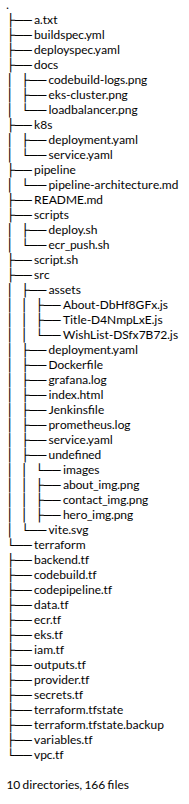

## <bold>VPC NETWORK ARCHITECTURE:</bold>


# ⚙️ CI/CD Pipeline Workflow

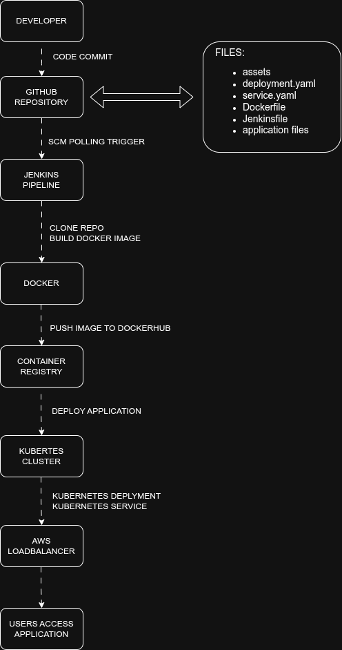

<details>

<summary>🔽 Click to Expand Pipeline Explanation</summary>

### Step 1 – Code Commit

Developers push code to the **GitHub repository**.
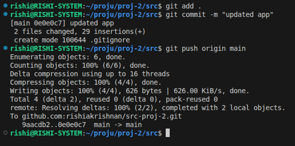

---

### Step 2 – Pipeline Trigger

GitHub triggers **jenkins project** automatically.
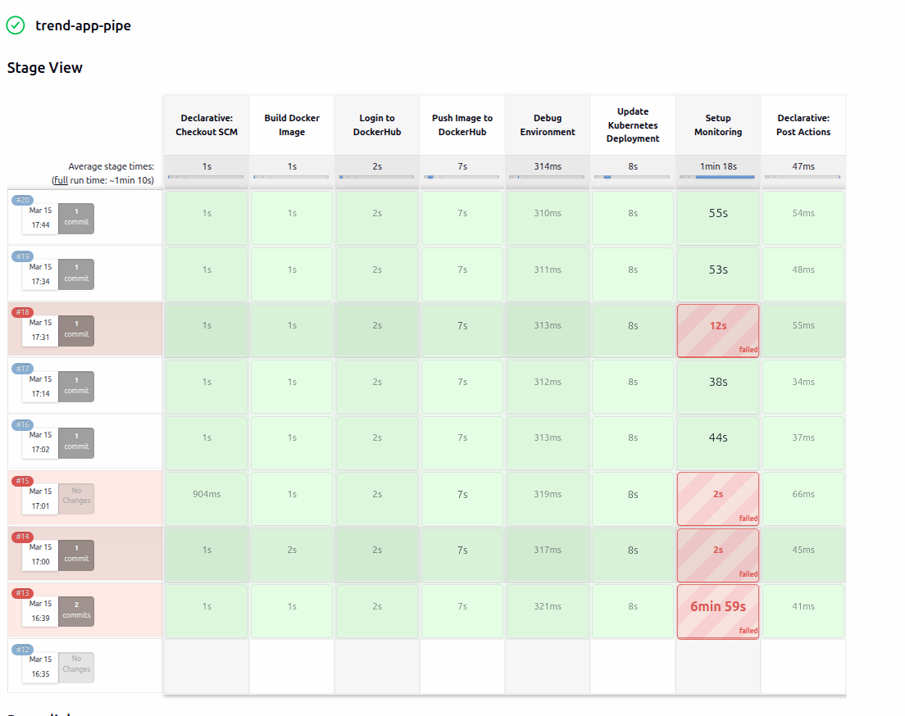
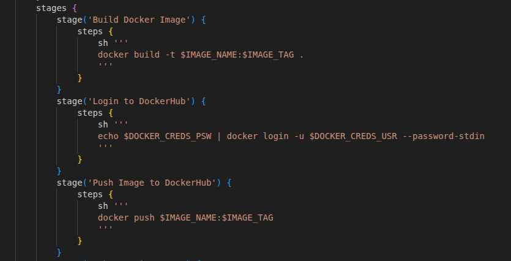
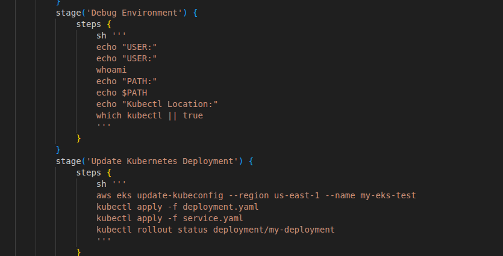
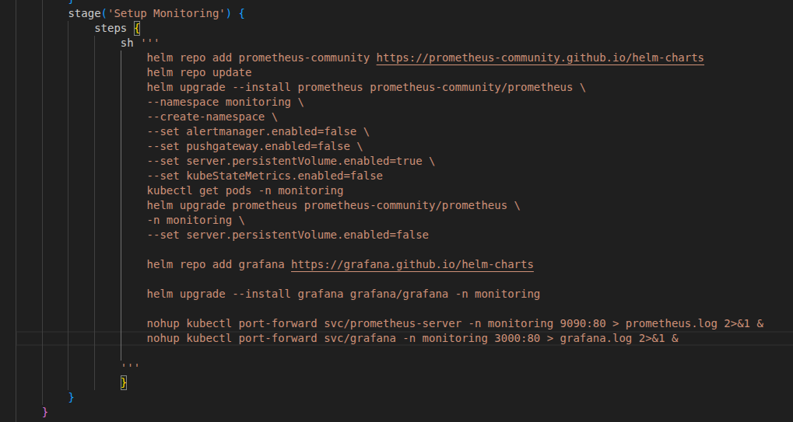
---

### Step 3 – Deploy Stage

Second CodeBuild stage:

- Authenticate with EKS
- Pull image from dockerhub
- Apply Kubernetes manifests
- Update deployment

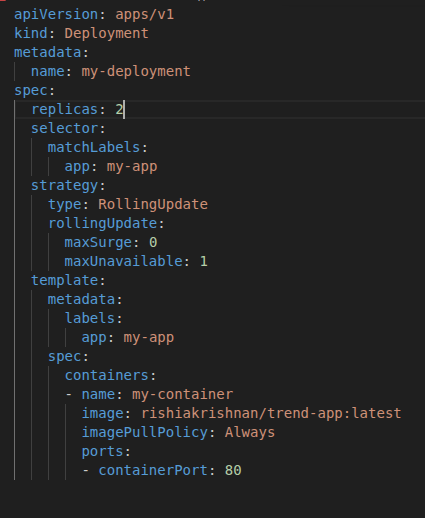

---

### Step 4 – Monitor Stage

CodeBuild performs:

- Install dependencies
- Install Prometheus
- Install Grafana
- Push image to **Amazon EKS**

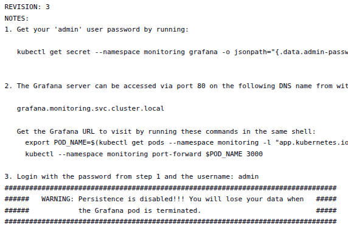

---

### Step 5 – Application Deployment

Application runs inside **Amazon EKS** and is exposed via **LoadBalancer Service** on **port 80**.
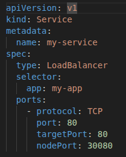
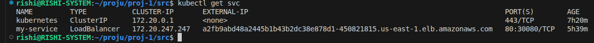

</details>

---

# 🏗 Infrastructure Provisioning

Infrastructure is created using **Terraform**.

<details>

<summary>🔽 Resources Created</summary>

## Infrastructure Components

- ### **VPC**
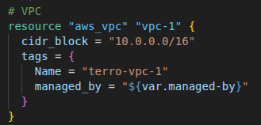
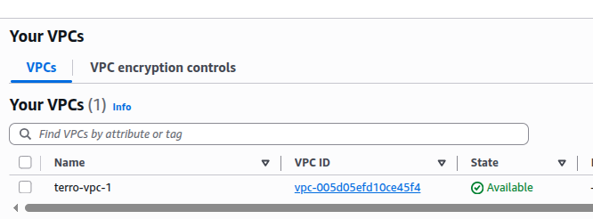
- ### **Public & Private Subnets**
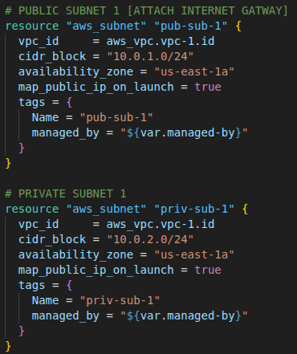
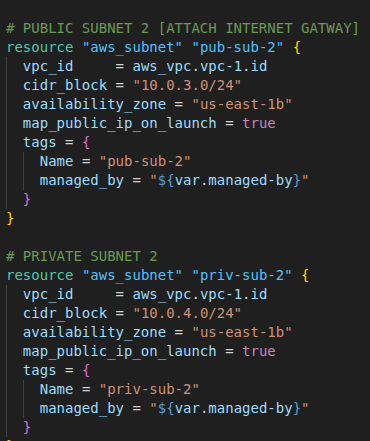
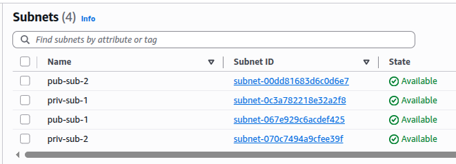
- ### **Internet Gateway**
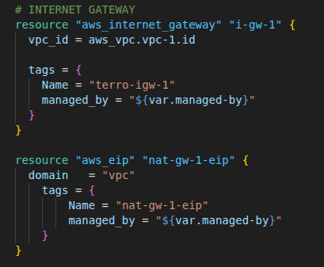
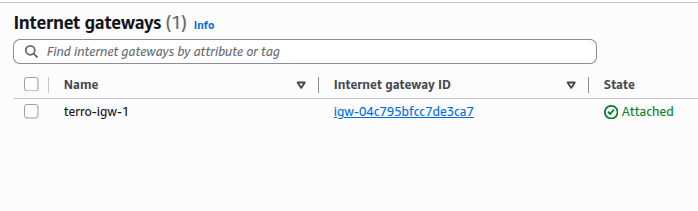
- ### **Security Groups**
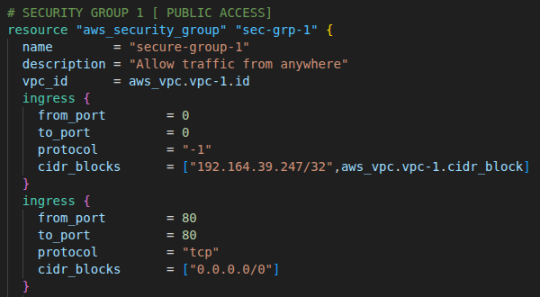
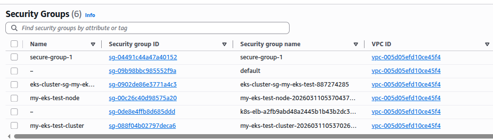
- ### **IAM Roles**
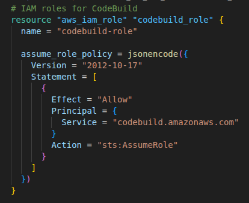
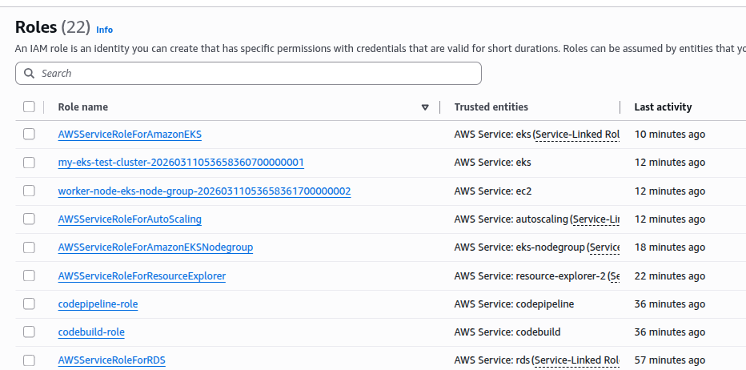
- ### **Amazon EKS Cluster**
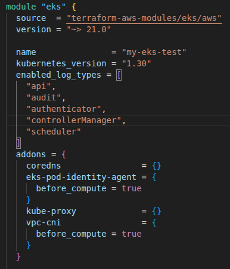
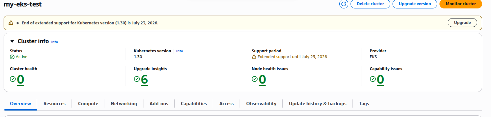
- ### **Docker Hub Repository**
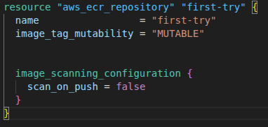
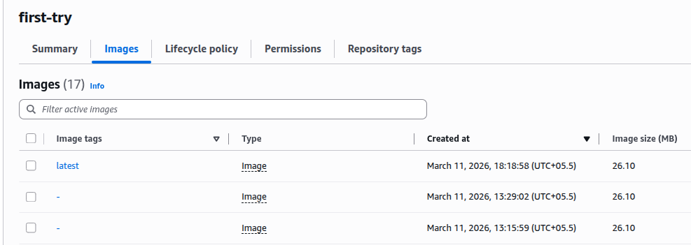
</details>

---

# ☸ Kubernetes Deployment

The application is deployed using Kubernetes manifests.

<details>

<summary>🔽 Kubernetes Resources</summary>

### Deployment

Responsible for running the application containers.

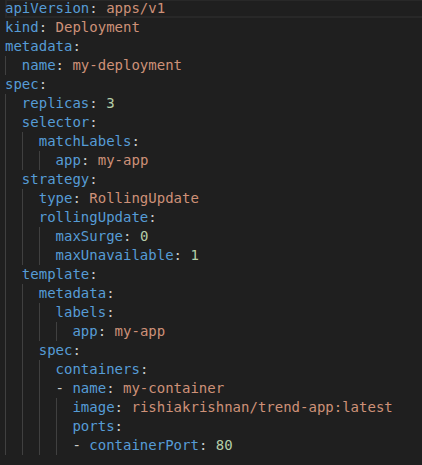
### Service

Exposes the application externally using **LoadBalancer**.

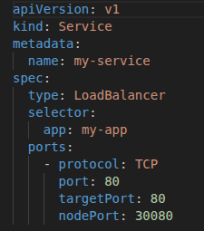

</details>

---

# 🖼 Deployment Screenshots

You can add screenshots like this.

### JenkinsFile Stage Execution

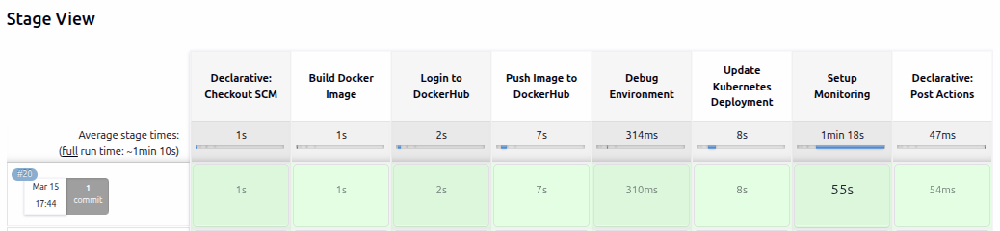

---

### EKS Pods

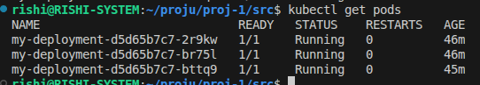

---

### Application Running


---

# 🛠 Deployment Steps

<details>

<summary>🔽 Click to Expand Deployment Steps</summary>

### 1️⃣ Clone Repository

```bash
git clone https://github.com/rishiakrishnan/jenkins-eks-cicd.git
````

---

### 2️⃣ Initialize Terraform

```bash
cd terraform

terraform init
```

---

### 3️⃣ Plan Infrastructure

```bash
terraform plan
```

---

### 4️⃣ Apply Infrastructure

```bash
terraform apply
```

This will provision:

* EKS Cluster
* VPC And SUBNETS
* And Other Networking Components

---

### 5️⃣ Push Source To Github

```bash
cd ../src

git add .
git commit -m "something"
git push origin main
```
</details>

---

# 🔍 Verify Deployment

Connect kubectl to eks

```bash
aws eks --region us-east-1 update-kubeconfig --name my-eks-test
```

Check running pods

```bash
kubectl get pods
```

Check services

```bash
kubectl get svc
```

---

# 🦾 Connections and Port Forwarding

connect data source

```bash
http://prometheus-server.monitoring.svc.cluster.local
```

To Get Password

```bash
kubectl get secret grafana -n monitoring -o jsonpath="{.data.admin-password}" | base64 --decode ; echo
```

Port Forwarding For Grafana

```bash
kubectl port-forward svc/grafana 3006:80 -n monitoring
```

Port Forwarding For Prometheus

```bash
kubectl port-forward svc/prometheus-server 9096:80 -n monitoring
```

Port Forwarding If There Is Local Jenkins App

```bash
ngrok http 8080
```
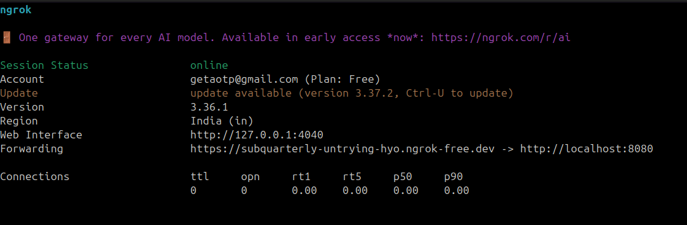

Access the application

```
http://<load-balancer>
```

---

# 📈 Future Improvements

* 🔹 Blue-Green / Canary Deployment Strategy
* 🔹 Automated Alerting with Prometheus
* 🔹 Kubernetes Horizontal Pod Autoscaling (HPA)
* 🔹 Jenkins Pipeline for Automated Testing

---
# 👨‍💻 Author

**Rishi Krishnan**

DevOps & Cloud Engineer passionate about building **scalable, automated, and production-ready infrastructure** using modern DevOps practices.  
This project demonstrates hands-on experience with **CI/CD pipelines, containerized applications, Kubernetes orchestration, and Infrastructure as Code on AWS**.

---

## 🔧 Technical Skills

- **Cloud Platforms:** AWS (EKS, ECR, CodePipeline, CodeBuild, VPC, IAM, S3)
- **Infrastructure as Code:** Terraform
- **Containerization:** Docker
- **Container Orchestration:** Kubernetes
- **CI/CD:** AWS CodePipeline, AWS CodeBuild, GitHub, Jenkins
- **Monitoring & Observability:** Prometheus, Grafana
- **Version Control:** Git, GitHub
- **Operating Systems:** Linux

---

## 📂 Areas of Interest

- Cloud Native Architecture  
- DevOps Automation  
- Kubernetes Platform Engineering  
- Infrastructure as Code  
- Observability & Monitoring Systems

---

## 📫 Contact

- **Email:** rishiakrishnan@gmail.com
- **GitHub:** https://github.com/rishiakrishnan
- **LinkedIn:** https://linkedin.com/in/rishiakrishnan

---

⭐ If you found this project useful, feel free to star the repository.
---


aws eks --region us-east-1 update-kubeconfig --name my-eks-test


kubectl rollout restart deployment my-deployment


nohup kubectl port-forward svc/prometheus-server -n monitoring 9090:80 > prometheus.log 2>&1 &

nohup kubectl port-forward svc/grafana -n monitoring 3000:80 > grafana.log 2>&1 &


kubectl get secret grafana -n monitoring -o jsonpath="{.data.admin-password}" | base64 --decode ; echo

kubectl get secret grafana -n monitoring -o jsonpath="{.data.admin-password}" | base64 --decode ; echo


kubectl port-forward svc/prometheus-server 9096:80 -n monitoring

kubectl port-forward svc/grafana 3006:80 -n monitoring

http://prometheus-server.monitoring.svc.cluster.local